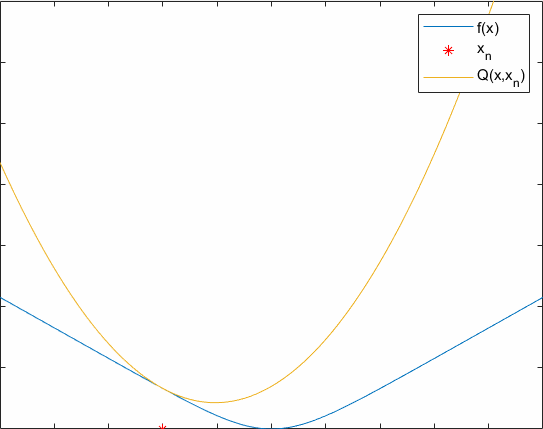

  
##  EM Algorithm Derivation and Auxiliary function
  
  
###  Introduction
  
  
We often want to estimate model parameters from observed data, and the most common method is to maximize the maximum likelihood of a statistical model, i.e. maximum likelihood estimation (MLE). But in some cases the data is incomplete, e.g. some labels are missed or some variable cannot be observed, so directly applying MLE can be quite difficult. And Expectation–maximization (EM) algorithm is proposed to maximize the likelihood with these hidden variables.
  
The idea of the EM algorithm to solve hidden variables is to use a iterative method. We first guess the hidden data (Expectation step), then based on the observed data and guessed hidden data we can maximize the log-likelihood and solve our model parameters (Maximization step).
  
Next we will see the derivation of it with a simple example.
  
###  Derivation
  
  
Suppose we weigh a batch of vehicles that leave the factory, and there two types of cars, which are labeled as  and . And we already know that the weight of each type conform the Gaussian distribution:
  

  
  
  
So if we have complete data, data=, we can simply maximize the log-likelihood with iid assumption:
  

  
  
  
Adding the constrain , and using Lagrange multiplier, we can solve it:
  

  
  
, if , otherwise 0.
  
But if all cars are covered with a black cloth, we cannot get the type. The data becomes . So the log-likelihood changes to:
  

  
  
  
Theoretically, we can compute gradient of this function and get maximum. However, you will find it quite difficult, since the sum is embedded in . If we can extract the sum outside , it can be much easier. Jensen’s inequality help to do this.
  
####  Jensen’s inequality
  
  
If  is convex and  a random variable then:
  

  
  
  
The equal sign holds if and only if , i.e.  is a constant.
  
Here I just give an example to help intuitive understanding. Suppose X is discrete and  is convex, we can get the following picture.

  
And if  is concave, .
  
Back to the log-likelihood. First we introduce a unknown distribution  with . Given log is concave, apply Jensen's inequality:
  

  
  
  
Here we get a lower bound of the log-likelihood. Suppose we initialize all parameters , if we can continuously increase this lower bound by iterating parameters, the log-likelihood also increases. EM actually uses two steps to increase the lower bound by iteration. 
  
####  E-step
  
  
In E-step, through choosing , the lower bound increase to the log-likelihood. From Jensen's inequality, only when  is a constant, the lower bound equals the log-likelihood. So we can get the following result.
  

  
  
  
So now we can represent the lower bound as:
  

  
  
  
 and  both represent values of parameters .  is fixed in this step.  is what we want to change to increase . Clearly if , the lower bound increase to the log-likelihood.
  
In E-step, we make the expected value of  as  with . This is why it is called expectation step.
  
####  M-step
  
  
In M-step, we optimize  by adjusting  with  fixed, and it is much easier to optimize than .
  

  
  
  
####  Summary
  
  
Now we can make a summary:
  
Input: observed data , the form of conditional distribution , the form of joint distribution , and the maximum number of iteration steps N.
  
First initialize  as .
  
For n=1 to N
  
E-step: , compute .
  
M-step: 
  

  
  
  
Though the example is simple, but we can generate it to any other model. Just replace  with all observed variable, and replace  with all hidden variable. 
  
####  Auxiliary Function
  
  
In E-step, we fix model parameters, and optimize the conditional distribution of hidden data. And in M-step, what we do is to fix the distribution of hidden data and optimize the values of model parameters. This idea is called auxiliary functions in mathematics.
  
 is an auxiliary function for , if it satisfies:
  
(i) 
  
(ii) 
  
Recall the property of , what we do is to construct an auxiliary function for , since:
  
(i) 
  
(ii) 
  
The update rule of an auxiliary function is .
  
A process of optimizing an auxiliary function is showed below. Hope it can help you understand the essence of EM.
  

  